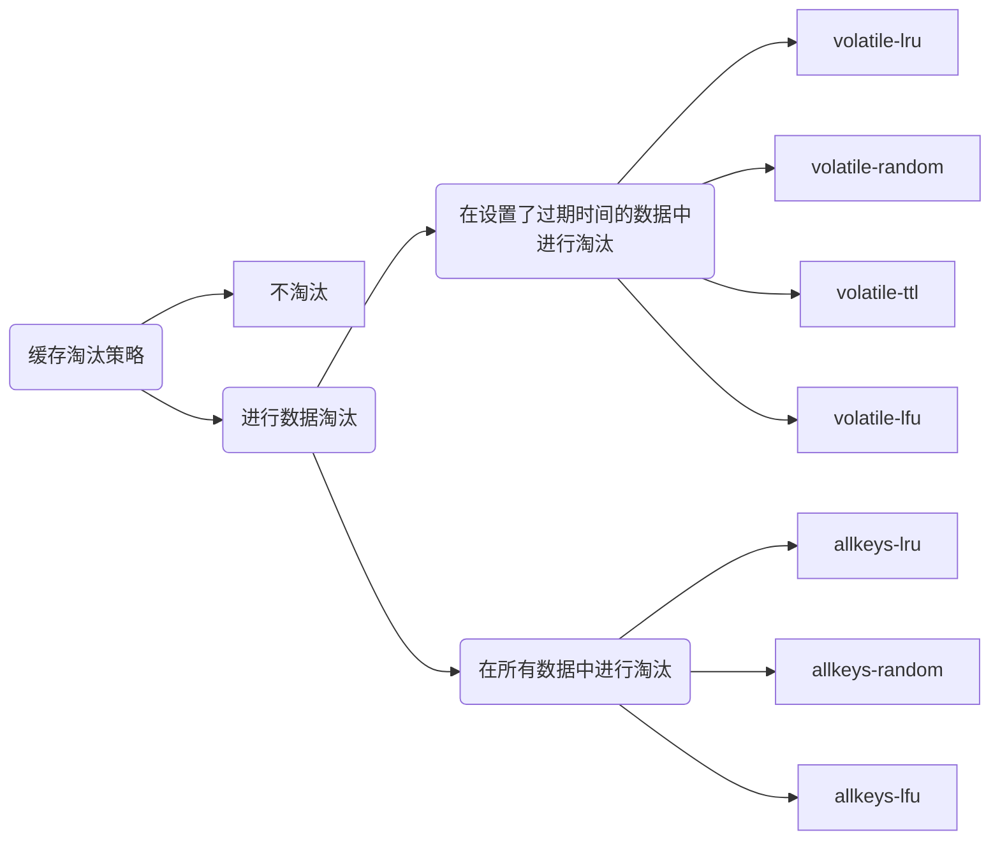

# Redis作为缓存的问题

由于Redis用作缓存的普遍性以及它在业务应用中的重要作用，所以需要系统地掌握缓存的一系列内容，包括工作原理、替换策略、异常处理和扩展机制。

## 一、Redis作为缓存是怎么工作的？

### 1. 缓存的特征

计算机系统中，默认有两种缓存：
- CPU里面的末级缓存，即LLC，用来缓存内存中的数据，避免每次从内存中存取数据；
- 内存中的高速页缓存，即page cache，用来缓存磁盘中的数据，避免每次从磁盘中存取数据。

跟内存相比，LLC的访问速度更快，而跟磁盘相比，内存的访问是更快的。

可以看出缓存具有如下特征：

1. 在一个层次化的系统中，缓存一定是一个快速子系统，数据存在缓存中时，能避免每次从慢速子系统中存取数据。
2. 缓存系统的容量大小总是小于后端慢速系统的，不可能把所有数据都放在缓存系统中。

### 2. Redis缓存处理请求的两种情况

业务应用在访问数据时，会先查询Redis中是否保存了相应的数据：
1. 缓存命中：直接读取，性能贼快
2. 缓存缺失：需要从后端数据库中读数据，性能会变慢。而且需要将缺失数据写入redis（缓存更新），这会涉及到缓存一致性问题。

### 3. 旁路缓存

如果应用程序想要使用Redis缓存，就要在程序中增加相应的缓存操作代码。所以，我们也把Redis称为旁路缓存。因为需要新增程序代码来使用缓存，所以，Redis并不适用于那些无法获得源码的应用。

### 4. 缓存类型

按照Redis缓存是否接受写请求，我们可以把它分成只读缓存和读写缓存。

1. 只读缓存
   
   读取数据时，会先调Redis GET接口，查询数据是否存在。而所有的数据写请求，会直接法网后端数据库，在数据库中进行增删改。对于删改的数据来说，如果redis已经缓存了相应的数据，应用需要把这些缓存的数据删除。

   **优点：** 所有最新的数据都在数据库中，不会有丢失的风险。当我们需要缓存图片、短视频这些用户只读数据时，就可以使用只读缓存这个类型了。

2. 读写缓存
   
   读请求的处理过程和只读缓存一样，而写请求也会被发送到缓存，在缓存中直接进行增删改操作。

   **优点：** 提升业务应用的响应速度。
   **缺点：** 最新的数据在redis中，有丢失风险。

   因此，根据业务应用对数据可靠性和缓存性能的不同要求，有同步直写（保证数据可靠性）、异步写回（提供快速响应）两种策略，以下进行详细说明：

   - 同步直写：写请求发给缓存的同时，也会发给后端数据库进行处理，等到缓存和数据库都写完数据，才给客户端返回
   - 异步写回：所有写请求先在缓存中处理，等到这些增改的数据要被从缓存中淘汰出来时，缓存将他们写回后端数据库。

## 二、替换策略：缓存满了怎么办？

redis使用内存保存数据，避免直接从后端数据库读数据，大大的提升效率，但是，由于内存较贵，不可能将数据全缓存在内存里（性价比极低），因此，缓存满了后，需要**缓存淘汰机制**。

### 1. 设置多大缓存合适？

实际使用中，数据的访问是具有局部性的，大致按“八二”原理，但是不能一概而论，需要结合应用**数据访问特征**和**成本开销**综合考虑。

系统的设计选择是一个权衡的过程：大容量的缓存能带来性能加速的收益，但是成本也会更高，而小容量的缓存不一定能起到加速效果。一般来说，**建议把缓存容量设置为总数据量的15%到30%，兼顾访问性能和内存空间开销**。

确定了缓存容量后，可以使用如下命令来设定缓存大小：
```bash
CONFIG SET maxmemory 4gb
```

### 2. Redis缓存有哪些淘汰策略？

缓存被写满是不可避免的，因此需要缓存淘汰策略，缓存淘汰策略一共有8种：



默认情况下，redis在使用的内存空间超过了maxmemory时，并不会淘汰数据，也就是设定的noeviction策略。缓存写满后redis不再提供写请求服务，直接返回错误。这种策略一般不用。

除此之外，volatile-ttl是越早过期的越先被删除，其他的淘汰策略就顾名思意了。

这也就是说，如果一个键值对被删除策略选中了，即使它的过期时间还没到，也需要被删除。当然，如果它的过期时间到了但未被策略选中，同样也会被删除。

#### LRU算法

> LRU算法会将所有数据组织成一个链表，链表的头和尾分别表示MRU端和LRU端
> - 当一个数据被读取时，该数据会被移动到MRU端。
> - 当一个数据被写入时，会写在MRU端，如果缓存已满，会从LRU端开始淘汰。
> 
> LRU算法认为刚刚访问的数据，肯定还会被再次访问，所以就将它放在MRU端；长久不访问的数据，肯定不会再被访问了，所以就让他主键后移到LRU端，缓存满时优先删除它。

#### Redis对LRU算法的简化

LRU算法在实现时，需要用链表管理所有缓存数据，会**带来额外的空间开销**，而且大量数据访问时，会带来很多链表移动操作，会很耗时，降低redis性能。

因此，Redis对LRU算法进行了简化，RedisObject中的lru字段会默认记录每个数据的最近一次访问的时间戳。在决定淘汰数据时，第一次会随机选出N个数据作为候选集合，然后将其中lru字段值最小的淘汰掉。其中N的配置如下所示：
```bash
CONFIG SET maxmemory-samples 100
```

当需要再次淘汰数据时，redis需要挑选数据进入第一次淘汰时创建的集合，挑选标准：**能进入候选集和的数据的lru字段值必须小于候选集合中最小的lru值**。当有新数据进入候选数据集后，如果数据集中的数据个数达到了maxmemory-samples，redis就会把候选集中lru字段值最小的数据淘汰出去。

这样一来，redis就不需要为所有数据维护一个大链表了，也不用在每次数据访问时都移动链表项了，提升了缓存性能。

#### 如何选择缓存淘汰策略？

以下三个建议：

- 如果业务数据中有明显的冷热之分，优先使用allkeys-lru。
- 如果业务应用中数据的访问频率相差不大，建议使用allkeys-random
- 如果业务中有置顶的需求，可以使用volatile-lru，同时不给置顶数据设置过期时间。

#### 缓存替换时的具体操作

一般来说，一旦被淘汰的数据选定后，如果时干净数据，那么就直接删除，否则需要将它写入数据库。

但是对redis来说，它决定了被淘汰的数据后，会直接把它们删除，即使是脏数据，redis也不会将其写入数据库，所以我们使用redis缓存时，如果数据被修改了，需要在数据修改时将其写回数据库。


## 三、缓存不一致问题

数据一致性包含两种情况：
- 如果缓存中有数据，那么缓存的数据值需要和数据库中的值相同；
- 缓存中没数据，那么数据库中的值必须是最新值。

如果不符合以上两种情况，就属于缓存和数据库的数据不一致问题了。

### 1. 缓存不一致是如何发生的？

根据读写缓存和只读缓存，分两种情况讨论。

#### 读写缓存

- 同步直写：写缓存时，也同步写数据库，缓存和数据库中数据是一致的（必须使用事务机制）；
- 异步写回：写缓存时不同步写数据库，等到数据从缓存中淘汰时，再写回数据库。当数据还没写回数据库，缓存就发生故障，就会出现数据不一致。（对数据一致性要求不是那么高时，可以采用）

#### 只读缓存

对于只读缓存来说，按增删改三种情况分析如下：
1. 新增数据
   
   数据会直接写入数据库中，不用对缓存做任何操作，此时缓存中本身就没有新增的数据，而数据库中是最新值。符合数据一致性。

2. 删改数据
   
   既要更新数据库，又要更新缓存，这两个操作如果不能保证原子性，就会出现数据不一致的问题，有以下两种情况：

   不同情况|潜在问题
   --|--
   先删除缓存值，后更新数据库值|数据库更新失败，导致请求再次访问缓存时，发现缓存缺失，再读数据库时，会读到旧值
   先更新数据库值，后删除缓存值|缓存删除失败，导致请求再次访问缓存时，从缓存中读到旧值。

##### 如何解决不一致问题？

**重试机制**：把要删除的缓存或者是要更新的数据库值暂存到消息队列中：

- 删除或更新失败时，从消息队列中重新读取这些值，再次进行删除或更新。
- 删除或更新成功时，从消息队列中去除这些值，以免重复操作。

这样就可以保证数据一致了，否则再次重试，如果重试超过一定次数，还是没有成功，就需要向业务层发送报错信息了。

##### 高并发下的缓存不一致问题

上述是在更新数据库和删除缓存的过程中，其中一个操作失败的情况，实际上，即使这两个操作第一次执行都成功，当有大量并发请求时，应用还是可能会读到不一致的数据。有以下两种情况：

- **先删除缓存，再更新数据库**：

时间|线程A|线程B|问题
--|--|--|--
t1|删除数据X的缓存值|-|-
t2|-|读取数据X，缓存缺失，从数据库读取X，读到旧值，写入缓存|线程A尚未更新数据库值，导致线程B读到旧值；线程B把旧值写入缓存，导致其他线程可能读取到旧值
t3|更新数据库中的X|-|缓存中是旧值，数据库中是新值，两者不一致

   解决方案：**延迟双删**。

   在线程A更新完数据库值以后，先让其sleep一小段时间（大于线程B读取数据再写入缓存的时间，根据统计进行估算），再进行一次缓存删除操作。如下所示：

   ```java
   redis.delKey(X);
   db.update(X);
   Thread.sleep(N);
   redis.delKey(X);
   ```
- **先删除数据库值，再删除缓存值**：

时间|线程A|线程B|问题
--|--|--|--
t1|删除数据库中的数据X|-|-
t2|-|读取数据X，缓存命中，得到旧值|线程A尚未删除缓存值，导致线程B读取到缓存的旧值
t3|删除缓存的数据|-|-

这种情况下，缓存删除后，可以从数据库中读取到新值，对业务影响较小

#### 总结

对于读写缓存，如果采用同步写回策略，可以保证缓存与数据库一致。

对于只读缓存，总结如下：

操作顺序|是否有并发请求|潜在问题|现象|应对方案
--|--|--|--|--
先删缓存后更新数据库|无|缓存删除成功，但数据库更新失败|应用从数据库读到旧值|重试数据库更新
先删缓存后更新数据库|有|缓存删除后，尚未更新数据库，有并发读请求|并发请求从数据库读到旧值，并更新到缓存，导致后续请求都读到旧值|延迟双删
先更新数据库后删缓存|无|数据库更新成功，但缓存删除失败|应用从缓存读到旧数据|重试缓存删除
先更新数据库后删缓存|有|数据库更新后，尚未删除缓存，有并发读请求|并发请求从缓存读到旧值|等待缓存删除完成，期间会有不一致的数据短暂存在

在大多数业务场景下，会把redis作为只读缓存使用，这种情况建议优先使用先更新数据库再删除缓存的方法，原因如下：
1. 先删除缓存再更新数据库，有可能导致因请求缺失而访问数据库，给数据库带来压力
2. 如果业务应用中读取数据库和写缓存的时间不好估算，那么，延迟双删中的sleep时间不好设置。

注意：如果要求数据必须一致，可以在更新数据库时，现在redis客户端暂存并发请求，等数据库更新完，缓存值删除后，再读取数据，从而保证数据一致性。


## 四、缓存雪崩、击穿、穿透

这三个问题一旦发生，会导致大量的请求积压到数据库层。如果并发量很大，就会导致数据库宕机或是故障。

### 1. 缓存雪崩

指大量应用请求无法在Redis缓存中进行处理而发送到数据库，导致数据库压力激增。

一般原因有二：

1. 大量key同时过期，导致大量请求无法在缓存处理。
   
   解决方案：

   - **微调过期时间**，给过期时间增加一个较小的随机数
   - **服务降级**：
     - 对于非核心数据，暂停从缓存中查询这些数据，直接返回预定义信息、空值、错误信息
     - 对于核心数据，仍然允许查询，如果缓存缺失，也可以从数据库读取。

2. redis宕机，无法处理请求，导致大量请求积压到数据库

   解决方案：

   - **服务熔断或请求限流**：暂停或限制业务应用对缓存系统的接口访问。redis恢复后再允许访问。
   - **事前预防**：通过主从节点的方式构建Redis缓存高可靠集群。

### 2. 缓存击穿

**指的是**：针对某个访问非常频繁的热点数据的请求，无法在缓存中处理，一下子都发送到了后端数据库。

**原因**：缓存击穿经常发生在热点数据过期失效时。

**解决方案**：对于访问特别频繁的热点数据，不设置过期时间。

### 3.缓存穿透

对于缓存雪崩和缓存击穿，数据库中还是保存了应用要访问的数据的，但是缓存穿透发生时，数据也不在数据库中。

一般有两种情况会发生缓存穿透：

1. 业务层误操作：缓存中的数据和数据库中的数据都被误删了。
2. 恶意攻击：专门访问数据库中没有的数据。

解决方案：

1. 缓存空值或缺省值；
2. 使用**布隆过滤器**快速判断数据是否存在，减轻数据库压力；
3. 在请求入口的前端进行请求检测，过滤掉不合法请求。


## 五、缓存污染

### 1. 成因

缓存污染是指：某些场景下，有些数据被访问次数非常少，甚至只被访问一次，当这些数据服务完访问请求后，如果还继续留存在缓存中的话，就会白白占用缓存空间，这种情况就是缓存污染。

解决缓存污染要从缓存淘汰策略下手，以下逐个分析：

- noeviction：显然没用；
- volatile-random和allkeys-random：也明显没用；
- volatile-ttl：在明确知道数据被再次访问的情况下，有用；
- **LRU：因为只看数据的访问时间，使用LRU策略在处理扫描式单次查询操作时，无法解决缓存污染。**

### 2. LFU策略避免缓存污染

与LRU相比，LFU策略中会从两个维度来筛选并淘汰数据：
1. 数据访问的时效性（访问时间离当前时间的远近）
2. 数据被访问次数

LFU首先根据访问次数进行筛选，把访问次数最低的数据淘汰掉，如果访问次数相同，LFU再比较两个数据的访问时效性，把距离上一次访问最久的淘汰掉。

### 3. Redis对LFU策略的优化

redis在实现LFU策略的时候，只是把原来24bit大小的lru字段，拆分成了两部分：

1. ldt值：lru字段的前16bit，表示数据的访问时间戳
2. counter值：lru字段的后8bit，表示数据的访问次数

redis只用了8bit记录数据访问次数，能表示的最大值是255，够吗？

其实Redis并没有采用数据每访问一次，就给对应的counter值加1的计数规则，而是采用了一个更优化的计数规则：
```C
double r = (double)rand() / RAND_MAX;
...
// baseval为counter当前值
double p = 1.0 / (baseval * server.lfu_log_factor + 1)
if (r < p) counter++;
```

可以设置不同的lfu_log_factor配置项，来控制计数器值增加的速度，避免counter值很快到255

[redis官网](https://redis.io/docs/manual/eviction/) 提供了一张表，记录了当lfu_log_factor取不同值的时候，在不同实际访问次数情况下，计数器的是是如何让变化的，实际一般可以将lfu_log_factor取值为10；

在一些场景下，有些数据在短时间内被大量访问后就不会再被访问了，因此，Redis的LFU策略还设计了一个counter值的衰减机制，使用衰减因子配置项**lfu_decay_time**来控制访问次数的衰减：

```C
diff = (nowTime - lastTime).toMinute()
v = diff / lfu_decay_time
// v即是数据counter要衰减的值
```

由此可见，lfu_decay_time越大，衰减效果越弱。在业务系统中，如果有短时高频访问的数据的话，建议把lfu_decay_time值设置为1，这样LFU策略在它们不再被访问时，较快的衰减他们的访问次数，避免缓存污染。

## 六、Pika-基于SSD实现大容量Redis
