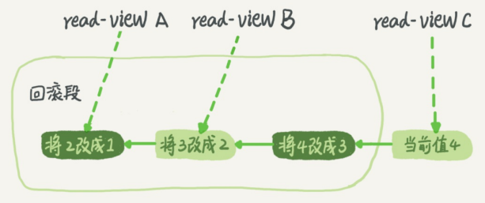

# 事务隔离

当数据库上有多个事务同时执行的时候，可能会出现脏读、不可重复读、幻读的问题，为了解决这些问题，就有了隔离级别的概念。

隔离的越严实，效率越低，因此很多时候，需要在二者之间寻找一个平衡点。

SQL标准的事务隔离级别有以下4种：
1. 读未提交：一个事务还没提交时，它做的变更就能被别的事务看到。
2. 读提交：一个事务提交后，它做的变更才会被其他事务看到。
3. 可重复读：一个事务执行过程中看到的数据，总是跟这个事务在启动的时候看到的数据是一致的，未提交的变更对其他的事务也是不可变的。
4. 串行化：对同一行记录，”写“会加”写锁“，”读“会加”读锁“，出现读写冲突时，后访问的事务必须等前一个事务执行完成才能继续执行

假设数据表T中只有一列，其中一行的值为1

```sql
mysql> create table T(c int) engine=InnoDB;
insert into T(c) values(1);
```

下面是按照时间顺序执行两个事务的行为：

事务A|事务B
:--:|:--:
启动事务,查询得到值1|启动事务
-|查询得到值1
-|将1改成2
查询得到值v1|
-|提交事务B
查询得到值v2|
提交事务A|
查询得到值v3

- 若隔离级别是”读未提交“，则v1的值是2，此时事务B虽然还没提交，但结果已经被A看到了，因此v2、v3值也是2
- 若隔离级别是”读提交“，则v1的值是1，v2的值是2，事务B的更新在提交后才能被A看到，所以v3值也是2
- 若隔离级别是”可重复读“，则v1、v2是1，v3是2，因为事务在执行期间看到的数据前后必须是一致的
- 若隔离级别是”串行化“，则在事务B执行”将1改成2“的时候，会被锁住。直到事务A提交后，事务B才可以继续执行。所以从A的角度看，v1、v2是1，v3是2

在不同的隔离级别下，数据库行为是有所不同的。Oracle数据库的默认隔离级别其实就是“读提交”，因此对于一些从Oracle迁移到MySQL的应用，为保证数据库隔离级别的一致，一定要将MySQL的隔离级别设置为“读提交”：将启动参数**transaction-isolation**的值设置成**READ-COMMITTED**

## 事务隔离的实现

在实现上，数据库里面会创建一个视图，访问的时候以视图的逻辑结果为准。

- 可重复读：视图是在事务启动时创建的，整个事务存在期间都用这个视图。
- 读提交：视图是在每个SQL语句开始执行的时候创建的。
- 读未提交：直接返回记录上的最新值，没有视图概念。
- 串行化：直接用加锁的方式来避免并行访问。

这里展开说明“可重复读”具体是怎么实现的

实际上在MySQL中，每条记录在更新的时候都会记录一条回滚操作。记录上的最新值，通过一个回滚操作，都可以得到前一个状态的值。

假设一个值从1被按顺序改成了2、3、4，在回滚日志里面会有类似下面的记录：



当前值是4，但是在查询这条记录的时候，不同时刻启动的事务会有不同的read-view。如图中看到，在视图A、B、C里面，这一个记录的值分别是1、2、4，同一个记录在系统中可以存在多个版本，就是数据库的多版本并发控制（MVCC）。对于视图A，要得到1，就必须将当前值依次执行图中所有的回滚操作看到。

当系统里没有比这个回滚日志更早的read-view时候，才会删除该回滚日志。

因此如果使用长事务，意味着系统里会存在很多很老的事务视图，占用大量空间，还占用锁资源，也可能拖垮整个库。

## 事务的启动方式

如前面所述，长事务有这些潜在风险，我当然是建议你尽量避免。其实很多时候业务开发同学并不是有意使用长事务，通常是由于误用所致。MySQL的事务启动方式有以下几种：

1. 显式启动事务语句， begin 或 start transaction。配套的提交语句是commit，回滚语句是rollback。
2. set autocommit=0，这个命令会将这个线程的自动提交关掉。意味着如果你只执行一个select语句，这个事务就启动了，而且并不会自动提交。这个事务持续存在直到你主动执行commit 或 rollback 语句，或者断开连接。

有的客户端连接框架会在默认连接成功后先执行一个set autocommit=0的命令，导致接下来的查询都在事务中，如果是长连接，就导致了意外的长事务。因此建议set autocommit=1，通过显式语句的方式来启动事务。

在autocommit为1的情况下，用begin显式启动的事务，如果执行commit则提交事务。如果执行commit work and chain，则是提交事务并自动启动下一个事务，这样也省去了再次执行begin语句的开销。同时带来的好处是从程序开发的角度明确地知道每个语句是否处于事务中。

可以在information_schema库的innodb_trx这个表中查询长事务，比如下面这个语句，用于查找持续时间超过60s的事务。

```sql
select * from information_schema.innodb_trx where TIME_TO_SEC(timediff(now(),trx_started))>60
```

