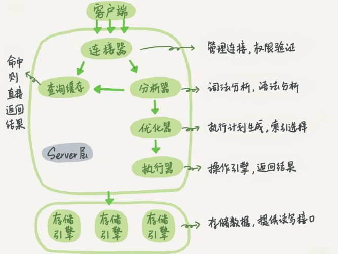

# 基础架构

mysql的基础架构图如下所示：



MySQL可以分为Server层和存储引擎层两部分。

- Server层：包括连接器、查询缓存、分析器、优化器、执行器等，涵盖大多数核心服务功能，以及所有内置函数，所有跨存储引擎的功能都在这一层实现，如存储过程、触发器、视图等。

- 存储引擎：负责数据的存储和提取，其架构模式是插件式的。支持多个存储引擎，最常用的式InnoDB，它从MySQL5.5.5版本开始就成为了默认存储引擎。

## 一条sql查询语句是怎么执行的？

以该sql的执行过程为例

```bash
mysql> select * from T where ID=10;
```

## 连接器

首先要先连接到这个数据库上，连接器负责和客户端建立连接、获取权限、维持和管理连接，连接命令如下

```bash
mysql -h$ip -P$port -u$user -p
```

虽然-p后可以直接写密码，但这样可能会导致密码泄露，不推荐这么做。

连接命令中的mysql式客户端工具，用来跟客户端建立连接，在完成TCP握手后，连接器开始验证身份

- 如果用户名或密码不对，会收到一个“Access denied for user”错误，然后客户端程序结束执行；
- 如果认证通过，连接器会到权限表里面查出你拥有的权限，之后，这个连接里面的权限判断逻辑，都依赖此时读到的权限。

因此，一个用户建立连接后，即使用管理员账号对这个用户的权限做了修改，也不能影响已经存在连接的权限。修改完成后，只有再新建的连接才会使用新的连接设置。

连接完成后，如果你没有后续动作，这个连接就处于空闲状态，可以再**show precesslist**看到它；

客户端如果太长时间没有动静，连接器就会自动断开，这个时间是由**wait_timeout**参数控制的，默认是8小时。

如果连接被断开后，客户端再次发送请求，就会收到一个错误提醒：**Lost connection to MySQL server during query**，就需要重连后在执行器请求了。

建立连接的过程通常复杂，建议在使用中尽量减少建立连接的动作，**尽量使用长连接**。

但是如果全部使用长连接后，MySQL占用内存可能会涨的很快，这是因为MySQL在执行过程中临时使用的内存是管理在连接对象里的。这些资源在连接断开的时候才会释放，所以如果长连接累积下来，可能导致内存占用过大，被系统强行杀掉（OOM），从现象看就是MySQL异常重启了。

怎么解决？两种方案：

1. **定期断开长连接**。使用一段时间，或者程序里面判断执行过一个占用内存的大查询后，断开连接，之后查询要重连。
2. 如果用的是MySQL5.7或更新版本，可以在每次执行一个比较大的操作后，通过执行**mysql_reset_connection**来初始化连接资源。这个过程不需要重连和重新做权限验证，但是会将连接恢复到刚刚创建完时的状态。

## 查询缓存

连接建立完成后，就可以执行select语句了，执行逻辑就会来到第二步：查询缓存

MySQL拿到一个查询请求后，会先到查询缓存看看之前是不是执行过这条语句。之前执行过的语句及其及结果可能会以key-value的形式，被直接缓存在内存中。要是有，直接就返回了，否则继续执行后面的阶段。

**大多数情况下不建议使用查询缓存，因为往往利大于弊**

查询缓存的失效非常频繁，只要有对一个表更新，这个表上的所有查询操作都会被清空，对于更新压力大的数据库来说，查询缓存的命中率会很低，除非是一些不怎么更新的表。

可以将参数**query_cache_type**设置为**DEMAND**，这样对于默认的SQL语句都不使用查询缓存。而对于你确定要使用查询缓存的语句，可以用**SQL_CACHE**显式指定：

```bash
mysql> select SQL_CACHE * from T where ID=10;
```

注意：MySQL8.0版本直接将查询缓存功能整块删掉了。。。

## 分析器

分析器先做词法分析，MySQL需要识别出SQL语句中的字符串分别是什么，代表什么，然后根据词法分析的结果做语法分析，生成语法规则，判断输入的SQL语句是否满足MySQL语法。如果语句不对，会给出**You have an error in your SQL syntax**的错误提醒。

一般语法错误会提示第一个出现错误的位置，所以你要关注的是紧接“use near”的内容。

## 优化器

经过了分析器，MySQL就知道你要做什么了，在开始执行之前，还要先经过优化器处理。

优化器是在表里有多个索引的时候，决定使用那个索引；或者在一个语句有多表关联的时候，决定各个表的连接顺序。

优化器阶段完成后，这个语句的执行方案就确定下来了，然后进入执行器阶段。

## 执行器

开始执行的时候，先判断你对这个表T有没有查询权限，如果没有，直接返回错误提示；如果有，就会打开表继续执行。打开表的时候，执行器就会根据表的引擎定义，去使用这个引擎提供的接口。

比如我们这个例子中的表T中，ID字段没有索引，那么执行器的执行流程是这样的：

1. 调用InnoDB引擎接口取这个表的第一行，判断ID值是不是10，如果不是则跳过，如果是则
将这行存在结果集中；
2. 调用引擎接口取“下一行”，重复相同的判断逻辑，直到取到这个表的最后一行。
3. 执行器将上述遍历过程中所有满足条件的行组成的记录集作为结果集返回给客户端。

至此，这个语句就执行完成了。

对于有索引的表，执行的逻辑也差不多。第一次调用的是“取满足条件的第一行”这个接口，之后
循环取“满足条件的下一行”这个接口，这些接口都是引擎中已经定义好的。

你会在数据库的慢查询日志中看到一个rows_examined的字段，表示这个语句执行过程中扫描了
多少行。这个值就是在执行器每次调用引擎获取数据行的时候累加的。

在有些场景下，执行器调用一次，在引擎内部则扫描了多行，因此引擎扫描行数跟
rows_examined并不是完全相同的。