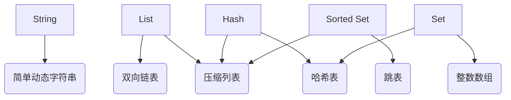

# 数据类型

redis的value提供如下数据类型：

1. String（字符串）
2. List（列表）
3. Hash（哈希）
4. Set（集合）
5. Sorted Set（有序集合）

简单来说，redis底层数据结构一共6种：

1. 简单动态字符串
2. 双向链表
3. 压缩列表
4. 哈希表
5. 跳表
6. 整数数组

这些数据结构和redis数据类型的对应关系如下图所示：

可以看到，除了String值对应1种数据结构，其他4种都对应2种底层实现结构，这4种为集合类型：一个键对应了一个集合的数据。

## 集合数据的操作效率

各个数据结构的查找效率如下表：

名称|时间复杂度
:--:|:--:
哈希表|O(1)
跳表|O(logN)
双向链表|O(N)
压缩列表|O(N)
整数数组|O(N)

其他不同操作的复杂度总结如下：

1. 单元素操作，是指每一种集合类型对单个数据实现的增删改查操作，复杂度由集合采用的数据结构决定
2. 范围操作，是指集合类型中的遍历操作，可以返回集合中的所有数据，这类操作的复杂度一般是O(N)，比较耗时，应该尽量避免。
3. 统计操作，是指集合类型对集合中所有元素个数的记录，例如LLEN和SCARD。这类操作复杂度只有O(1)，这是因为当集合类型采用压缩列表、双向链表、整数数组这些数据结构时，这些结构中专门记录了元素的个数统计
4. 例外情况，某些数据结构有特殊记录，例如压缩列表和双向链表都会记录表头和表尾的偏移量，对于头和尾的操作可以通过偏移量直接定位。
