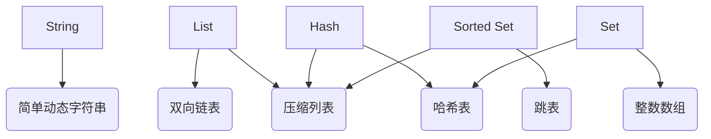

# 数据类型

redis的value提供如下数据类型：

1. String（字符串）
2. List（列表）
3. Hash（哈希）
4. Set（集合）
5. Sorted Set（有序集合）

简单来说，redis底层数据结构一共6种：

1. 简单动态字符串
2. 双向链表
3. 压缩列表
4. 哈希表
5. 跳表
6. 整数数组

这些数据结构和redis数据类型的对应关系如下图所示：



可以看到，除了String值对应1种数据结构，其他4种都对应2种底层实现结构，这4种为集合类型：一个键对应了一个集合的数据。

## RedisObject

redis并没有直接使用上述数据结构来直接实现key、value数据库，而是在上述数据结构之上又包了一层redisObject，源码如下：

```C
typedef struct redisObject {

    // 表示值的类型，涵盖了五大基本类型
    unsigned type:4;

    // 值的编码方式，表示Redis中实现各个底层数据结构，如SDS、压缩列表、哈希表、跳表等
    unsigned encoding:4;

    // 对象最后一次被访问的时间，用于淘汰过期的键值对
    unsigned lru:REDIS_LRU_BITS; /* lru time (relative to server.lruclock) */

    // 引用计数
    int refcount;

    // 是指向数据的指针。
    void *ptr;

} robj;
```

好处：

1. 通过不同类型的对象，Redis 可以在执行命令之前，根据对象的类型来判断一个对象是否可以执行给定的命令。
2. 可以针对不同的使用场景，为对象设置不同的实现，从而优化内存或查询速度。

如何自定义数据类型？

1. 定义新数据类型的底层结构
2. 在RedisObject的type属性中，增加这个新类型的定义
3. 开发新类型的创建和释放函数
4. 开发新类型的命令操作

## String详解

当保存的是64位有符号整数时，String类型会将其保存为一个8字节的long类型整数，即int编码模式。
但是当要保存的数据中包含字符时，String类型就会采用简单动态字符串（SDS）结构体来存储。SDS的声明如下：

```C
typedef char *sds;      //这里的sds就是sdshdr的buf指针

struct sdshdr {
    unsigned int len;   // 表示buf已用长度
    unsigned int free;  // 表示buf实际分配长度
    char buf[];         //  保存实际数据，以“\0”结尾
};
```

为了节省内存空间，Redis还对Long类型整数和SDS的内存布局做了专门的设计。

1. 当保存的是Long类型整数时，RedisObject中的指针就直接赋值为整数数据了，这样就不用额外的指针再指向整数了，节省了指针的空间开销。
2. 当保存是字符串且小于等于44字节时，RedisObject中的元数据、指针和SDS是一块连续的内存区域，这样就可以避免内存碎片。这种布局方式也被称为embstr编码方式。
3. 当字符串大于44字节时，Redis就会给SDS分配独立的空间，并用指针指向SDS结构。这种布局方式被称为raw编码模式。

## 压缩列表

压缩列表（ziplist），这是一种非常节省内存的结构。

构成：表头有三个字段zlbytes、zltail和zllen，分别表示列表长度、列表尾的偏移量，以及列表中的entry个数。压缩列表尾还有一个zlend，表示列表结束。
压缩列表之所以能节省内存，就在于它是用一系列连续的entry保存数据。每个entry的元数据包括下面几部分：

1. prev_len，表示前一个entry的长度。prev_len有两种取值情况：1字节或5字节。取值1字节时，表示上一个entry的长度小于254字节。虽然1字节的值能表示的数值范围是0到255，但是压缩列表中zlend的取值默认是255，因此，就默认用255表示整个压缩列表的结束，其他表示长度的地方就不能再用255这个值了。所以，当上一个entry长度小于254字节时，prev_len取值为1字节，否则，就取值为5字节。
2. len：表示自身长度，4字节；
3. encoding：表示编码方式，1字节；
4. content：保存实际数据。

Redis基于压缩列表实现了List、Hash和Sorted Set这样的集合类型

## 集合类型保存单值的键值对

可以采用基于Hash类型的二级编码方法，把一个单值的数据拆分成两部分，前一部分作为Hash集合的key，后一部分作为Hash集合的value，这样一来，我们就可以把单值数据保存到Hash集合中了。

二级编码方法是有讲究的。Hash表又两种底层存储方式，包括压缩列表和哈希表，Hash类型设置了用压缩列表保存数据时的两个阈值，一旦超过了阈值，Hash类型就会用哈希表来保存数据了：

```bash
hash-max-ziplist-entries    # 表示用压缩列表保存时哈希集合中的最大元素个数
hash-max-ziplist-value      # 表示用压缩列表保存时哈希集合中单个元素的最大长度
```

一旦从压缩列表转为了哈希表，Hash类型就会一直用哈希表进行保存，而不会再转回压缩列表了。
为了能充分使用压缩列表的精简内存布局，我们一般要控制保存在Hash集合中的元素个数。

---

## 集合数据的操作效率

各个数据结构的查找效率如下表：

名称|时间复杂度
:--:|:--:
哈希表|O(1)
跳表|O(logN)
双向链表|O(N)
压缩列表|O(N)
整数数组|O(N)

其他不同操作的复杂度总结如下：

1. 单元素操作，是指每一种集合类型对单个数据实现的增删改查操作，复杂度由集合采用的数据结构决定
2. 范围操作，是指集合类型中的遍历操作，可以返回集合中的所有数据，这类操作的复杂度一般是O(N)，比较耗时，应该尽量避免。
3. 统计操作，是指集合类型对集合中所有元素个数的记录，例如LLEN和SCARD。这类操作复杂度只有O(1)，这是因为当集合类型采用压缩列表、双向链表、整数数组这些数据结构时，这些结构中专门记录了元素的个数统计
4. 例外情况，某些数据结构有特殊记录，例如压缩列表和双向链表都会记录表头和表尾的偏移量，对于头和尾的操作可以通过偏移量直接定位。

## 对集合的统计效率

### 聚合统计

需要对多个集合进行聚合计算时，Set类型会是一个非常不错的选择。但是有一个潜在的风险：Set的差集、并集和交集的计算复杂度较高，因此数据量很大时直接执行这些计算，会导致redis实例阻塞。

建议：**可以从主从集群中选择一个从库，让它专门负责聚合计算，或者是把数据读取到客户端，在客户端来完成聚合统计**

### 排序统计

List是按照元素进入List的顺序进行排序的，而Sorted Set可以根据元素的权重来排序

- List：对比新元素插入前后，List相同位置上的元素就会发生变化，用LRANGE读取时，就会读到旧元素
- Sorted Set：如果数据更新频繁或者需要分页显示，建议你优先考虑使用Sorted Set。

### 二值状态统计

可以选择Bitmap。这是Redis提供的扩展数据类型

Bitmap本身是用String类型作为底层数据结构实现的一种统计二值状态的数据类型。String类型是会保存为二进制的字节数组，所以，Redis就把字节数组的每个bit位利用起来，用来表示一个元素的二值状态。可以把Bitmap看作是一个bit数组。

### 基数统计

基数统计就是指统计一个集合中不重复的元素个数。

用Hash和Set可以实现，但是数据量很大时，会消耗很多空间。

HyperLogLog是一种用于统计基数的数据集合类型

- 优势：当集合元素数量非常多时，它计算基数所需的空间总是固定的，而且还很小。
- 劣势：统计结果是有一定误差，标准误算率是0.81%

### 总结

数据类型|聚合统计|排序统计|二值统计|基数统计
:--:|:--:|:--:|:--:|:--:
Set|支持差集、交集、并集计算|不支持|不支持|精确统计，大数据量时，效率低，内存开销大
Sorted Set|支持交集、并集计算|支持|不支持|精确统计，大数据量时，效率低，内存开销大
Hash|不支持|不支持|不支持|精确统计，大数据量时，效率低，内存开销大
List|不支持|支持|不支持|不支持、元素没有去重
Bitmap|与、或、异或计算|不支持|支持，大数据量时，效率高，省内存|精确统计，内存开销大于HyperLogLog
HyperLogLog|不支持|不支持|不支持|概率统计、大数据量时，很节省内存

## 时间序列数据的保存