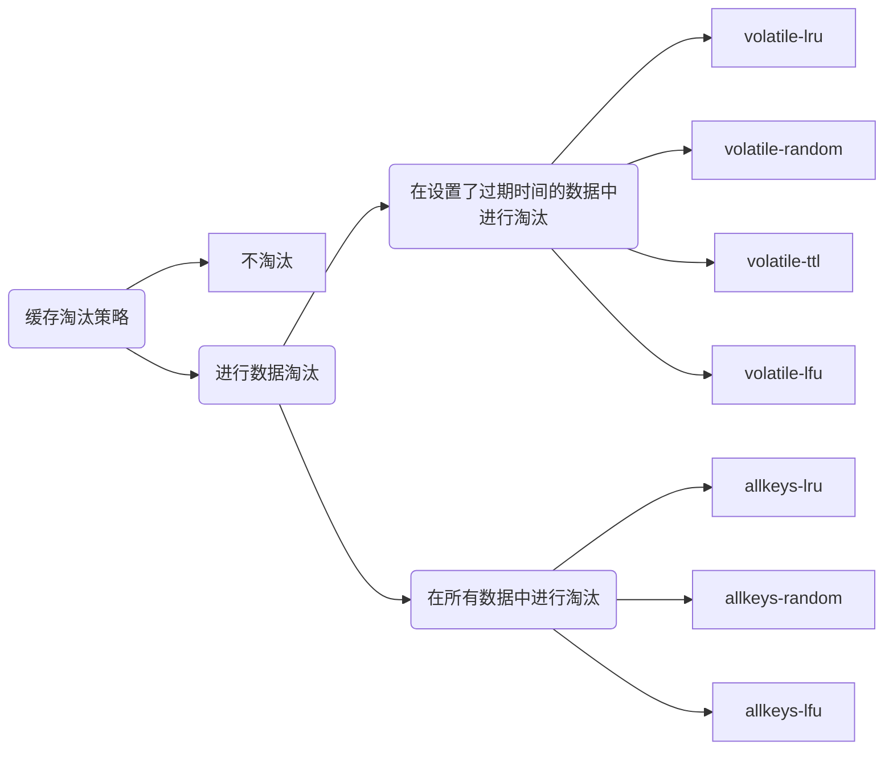

# Redis作为缓存的问题

由于Redis用作缓存的普遍性以及它在业务应用中的重要作用，所以需要系统地掌握缓存的一系列内容，包括工作原理、替换策略、异常处理和扩展机制。

## 一、Redis作为缓存是怎么工作的？

### 1. 缓存的特征

计算机系统中，默认有两种缓存：
- CPU里面的末级缓存，即LLC，用来缓存内存中的数据，避免每次从内存中存取数据；
- 内存中的高速页缓存，即page cache，用来缓存磁盘中的数据，避免每次从磁盘中存取数据。

跟内存相比，LLC的访问速度更快，而跟磁盘相比，内存的访问是更快的。

可以看出缓存具有如下特征：

1. 在一个层次化的系统中，缓存一定是一个快速子系统，数据存在缓存中时，能避免每次从慢速子系统中存取数据。
2. 缓存系统的容量大小总是小于后端慢速系统的，不可能把所有数据都放在缓存系统中。

### 2. Redis缓存处理请求的两种情况

业务应用在访问数据时，会先查询Redis中是否保存了相应的数据：
1. 缓存命中：直接读取，性能贼快
2. 缓存缺失：需要从后端数据库中读数据，性能会变慢。而且需要将缺失数据写入redis（缓存更新），这会涉及到缓存一致性问题。

### 3. 旁路缓存

如果应用程序想要使用Redis缓存，就要在程序中增加相应的缓存操作代码。所以，我们也把Redis称为旁路缓存。因为需要新增程序代码来使用缓存，所以，Redis并不适用于那些无法获得源码的应用。

### 4. 缓存类型

按照Redis缓存是否接受写请求，我们可以把它分成只读缓存和读写缓存。

1. 只读缓存
   
   读取数据时，会先调Redis GET接口，查询数据是否存在。而所有的数据写请求，会直接法网后端数据库，在数据库中进行增删改。对于删改的数据来说，如果redis已经缓存了相应的数据，应用需要把这些缓存的数据删除。

   **优点：** 所有最新的数据都在数据库中，不会有丢失的风险。当我们需要缓存图片、短视频这些用户只读数据时，就可以使用只读缓存这个类型了。

2. 读写缓存
   
   读请求的处理过程和只读缓存一样，而写请求也会被发送到缓存，在缓存中直接进行增删改操作。

   **优点：** 提升业务应用的响应速度。
   **缺点：** 最新的数据在redis中，有丢失风险。

   因此，根据业务应用对数据可靠性和缓存性能的不同要求，有同步直写（保证数据可靠性）、异步写回（提供快速响应）两种策略，以下进行详细说明：

   - 同步直写：写请求发给缓存的同时，也会发给后端数据库进行处理，等到缓存和数据库都写完数据，才给客户端返回
   - 异步写回：所有写请求先在缓存中处理，等到这些增改的数据要被从缓存中淘汰出来时，缓存将他们写回后端数据库。

## 二、替换策略：缓存满了怎么办？

redis使用内存保存数据，避免直接从后端数据库读数据，大大的提升效率，但是，由于内存较贵，不可能将数据全缓存在内存里（性价比极低），因此，缓存满了后，需要**缓存淘汰机制**。

### 1. 设置多大缓存合适？

实际使用中，数据的访问是具有局部性的，大致按“八二”原理，但是不能一概而论，需要结合应用**数据访问特征**和**成本开销**综合考虑。

系统的设计选择是一个权衡的过程：大容量的缓存能带来性能加速的收益，但是成本也会更高，而小容量的缓存不一定能起到加速效果。一般来说，**建议把缓存容量设置为总数据量的15%到30%，兼顾访问性能和内存空间开销**。

确定了缓存容量后，可以使用如下命令来设定缓存大小：
```bash
CONFIG SET maxmemory 4gb
```

### 2. Redis缓存有哪些淘汰策略？

缓存被写满是不可避免的，因此需要缓存淘汰策略，缓存淘汰策略一共有8种：



默认情况下，redis在使用的内存空间超过了maxmemory时，并不会淘汰数据，也就是设定的noeviction策略。缓存写满后redis不再提供写请求服务，直接返回错误。这种策略一般不用。

除此之外，volatile-ttl是越早过期的越先被删除，其他的淘汰策略就顾名思意了。

这也就是说，如果一个键值对被删除策略选中了，即使它的过期时间还没到，也需要被删除。当然，如果它的过期时间到了但未被策略选中，同样也会被删除。

#### LRU算法

> LRU算法会将所有数据组织成一个链表，链表的头和尾分别表示MRU端和LRU端
> - 当一个数据被读取时，该数据会被移动到MRU端。
> - 当一个数据被写入时，会写在MRU端，如果缓存已满，会从LRU端开始淘汰。
> 
> LRU算法认为刚刚访问的数据，肯定还会被再次访问，所以就将它放在MRU端；长久不访问的数据，肯定不会再被访问了，所以就让他主键后移到LRU端，缓存满时优先删除它。

#### Redis对LRU算法的简化

LRU算法在实现时，需要用链表管理所有缓存数据，会**带来额外的空间开销**，而且大量数据访问时，会带来很多链表移动操作，会很耗时，降低redis性能。

因此，Redis对LRU算法进行了简化，RedisObject中的lru字段会默认记录每个数据的最近一次访问的时间戳。在决定淘汰数据时，第一次会随机选出N个数据作为候选集合，然后将其中lru字段值最小的淘汰掉。其中N的配置如下所示：
```bash
CONFIG SET maxmemory-samples 100
```

当需要再次淘汰数据时，redis需要挑选数据进入第一次淘汰时创建的集合，挑选标准：**能进入候选集和的数据的lru字段值必须小于候选集合中最小的lru值**。当有新数据进入候选数据集后，如果数据集中的数据个数达到了maxmemory-samples，redis就会把候选集中lru字段值最小的数据淘汰出去。

这样一来，redis就不需要为所有数据维护一个大链表了，也不用在每次数据访问时都移动链表项了，提升了缓存性能。

#### 如何选择缓存淘汰策略？

以下三个建议：

- 如果业务数据中有明显的冷热之分，优先使用allkeys-lru。
- 如果业务应用中数据的访问频率相差不大，建议使用allkeys-random
- 如果业务中有置顶的需求，可以使用volatile-lru，同时不给置顶数据设置过期时间。

#### 缓存替换时的具体操作

一般来说，一旦被淘汰的数据选定后，如果时干净数据，那么就直接删除，否则需要将它写入数据库。

但是对redis来说，它决定了被淘汰的数据后，会直接把它们删除，即使是脏数据，redis也不会将其写入数据库，所以我们使用redis缓存时，如果数据被修改了，需要在数据修改时将其写回数据库。


## 三、缓存不一致问题


## 四、缓存雪崩、击穿、穿透


## 五、缓存污染


## 六、Pika-基于SSD实现大容量Redis
